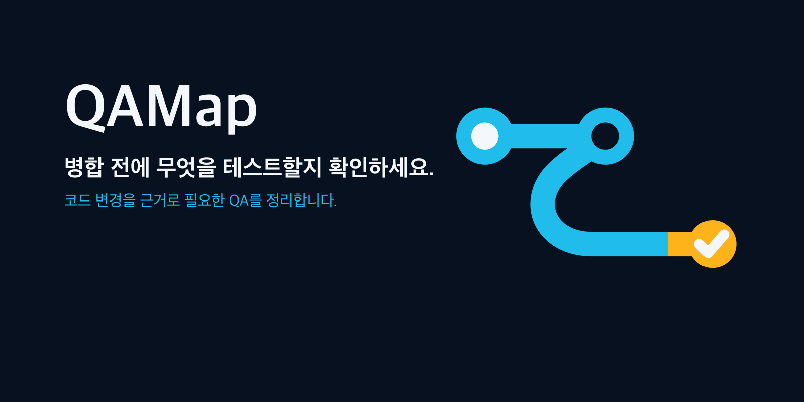

# QAMap

[English](README.md) | **한국어**

[](https://github.com/IvoryCanvas/QAMap/actions/workflows/ci.yml)
[](https://www.npmjs.com/package/@ivorycanvas/qamap)
[](LICENSE)



**병합 전에 무엇을 테스트할지 확인하세요.**

QAMap은 현재 브랜치의 커밋과 코드 변경, 저장소 구조, 기존 테스트를
로컬에서 살펴보고 병합 전에 확인할 내용을 정리하는 CLI입니다.

- 어떤 기능과 사용자 흐름이 달라졌는지
- 정상 동작뿐 아니라 실패, 경계값, 상태 변화에서 무엇을 확인해야 하는지
- 각 판단이 어느 파일과 코드에서 나왔는지
- 지금 실행할 수 있는 검증과 추가로 만들 수 있는 E2E 초안이 무엇인지

분석 과정에서 소스 코드를 외부로 보내거나 별도의 LLM을 호출하지 않습니다.
처음 사용할 때 설정 파일이나 테스트 실행 환경이 없어도 됩니다.

에이전트가 사용할 때는 여러 PR에서 반복되는 저장소 QA 정보와 이번 PR의
변경 내용을 따로 전달합니다. 같은 정보가 유지되는지는 식별자로 확인할 수
있지만, QAMap을 호출한 에이전트의 모델 사용량까지 0이 되는 것은 아닙니다.

## 설치하고 실행하기

터미널에서 직접 사용하려면 로컬 CLI를 실행하세요. ChatGPT나 Codex에서
같은 분석을 요청하려면 [QAMap 플러그인](https://chatgpt.com/plugins/plugins_6a752ca134a481919b90c45c09ab1629)을
설치할 수 있습니다.

### 로컬 CLI (권장)

QAMap은 Node.js 20 이상이 필요합니다. 가능하면
[현재 지원 중인 Node.js LTS](https://nodejs.org/en/about/previous-releases)를
사용하세요.

확인하려는 브랜치로 이동한 뒤 실행합니다.

#### 저장소를 바꾸지 않고 한 번 실행

저장소가 npm, pnpm, Yarn, Bun 중 무엇을 사용하더라도 다음 명령을 실행할
수 있습니다. 프로젝트 의존성이나 설정 파일은 바뀌지 않습니다.

```sh
npx --yes @ivorycanvas/qamap@latest qa
```

#### 반복 사용을 위해 프로젝트에 설치

프로젝트에서 QAMap 버전을 고정해 사용하려면 이미 쓰고 있는 패키지
매니저로 개발 의존성에 추가하세요.

| 패키지 매니저 | 설치 | 짧은 스크립트 추가 |
| --- | --- | --- |
| npm | `npm install --save-dev @ivorycanvas/qamap` | `npm exec -- qamap init --scripts` |
| pnpm | `pnpm add --save-dev @ivorycanvas/qamap` | `pnpm exec qamap init --scripts` |
| Yarn 1 이상 | `yarn add --dev @ivorycanvas/qamap` | `yarn qamap init --scripts` |
| Bun | `bun add --dev @ivorycanvas/qamap` | `bun run qamap init --scripts` |

짧은 스크립트와 다른 실행 방법은
[반복해서 CLI 사용하기](#반복해서-cli-사용하기)에서 확인할 수 있습니다.

### ChatGPT와 Codex 플러그인

에이전트가 PR 검토나 테스트 계획 중에 QAMap을 호출하도록 하려면
플러그인을 설치하세요.

[](https://chatgpt.com/plugins/plugins_6a752ca134a481919b90c45c09ab1629)

[QAMap 플러그인 페이지](https://chatgpt.com/plugins/plugins_6a752ca134a481919b90c45c09ab1629)
| [OpenAI 공식 설치 안내](https://learn.chatgpt.com/docs/plugins#install-and-use-a-plugin)

1. QAMap 플러그인 페이지를 엽니다.
2. **+**를 눌러 설치합니다.
3. 분석할 저장소를 연 ChatGPT 또는 Codex 작업에서 QAMap을 선택합니다.

플러그인도 같은 로컬 QAMap 패키지를 실행합니다. QAMap의 정적 분석은
별도의 LLM을 호출하지 않지만, QAMap을 호출하고 결과를 읽는 에이전트는
자체 모델과 권한을 사용합니다. 로컬 파일을 읽을 수 없는 일반 웹
대화에서는 현재 저장소를 분석할 수 없습니다.

## 결과 읽는 방법

| 출력 영역 | 확인할 내용 |
| --- | --- |
| **Change** | 이번 변경에서 달라졌을 가능성이 높은 동작 |
| **Verify before merge** | 병합 전에 확인할 정상, 실패, 경계값, 상태 변화 |
| **Evidence** | 판단에 사용한 커밋, 파일, 코드 위치 |
| **Next** | 지금 실행할 검증 또는 검토할 자동화 초안 |

기본 `qa` 명령은 코드를 분석할 뿐, 제품 QA나 테스트를 직접 실행하지
않습니다. 시나리오나 E2E 초안이 만들어져도 통과한 테스트로 표시하지
않습니다. 화면이나 저장 상태처럼 사용자가 확인할 수 있는 결과를 코드에서
찾지 못하면 임의의 검증 조건을 만들지 않고 근거가 부족하다고 표시합니다.

한 PR에서 서로 다른 테스트나 벤치마크가 함께 바뀌면 확인할 명령도 여러
개일 수 있습니다. `qamap qa run`은 안전 범위를 넓히지 않고 QAMap이 고른
명령 하나만 실행합니다. 나머지는 **Additional required validation**으로
보여주며, 직접 실행하기 전까지 `not run` 상태로 남습니다.
**Supplemental validation**은 저장소에 실행할 수 있는 명령이 있지만 이번
변경의 필수 검증으로 선택되지는 않았다는 뜻입니다.

지원하는 저장소 구조에서는 변경된 화면이나 진입점부터 실제로 필요한
모듈과 실행 조건까지 따라갑니다. 테스트가 그 조건을 모의 처리로
우회했다면 완전한 검증 근거로 보지 않습니다.

변경 파일이 없는 이미지를 참조하거나 검증 작업이 공유 이력을 바꿀 수
있다면 E2E보다 먼저 배포 무결성 문제로 알려줍니다. 지원하는 활성화 설정은
조건문과 설정 출처, 실제 실행 동작, 재시작 또는 새로고침 필요 여부를 함께
근거로 남깁니다.

## 실제 실행 예시

아래 녹화는 공개 예제 저장소를 사용합니다. QAMap은 중복 요청 위험과
관련 코드 위치를 찾고, 실제 실행 상태는 `not run`으로 남깁니다.


아래 코드 블록은 설명을 위해 번역한 문장이 아니라 현재 CLI가 실제로
출력하는 내용입니다.

```txt
QAMap QA
Local static analysis. No cloud or LLM token. Product QA was not run.

Change
  Prevent duplicate subscription renewal requests (medium confidence; review required)
  Flow:
    action: Prevent duplicate subscription renewal requests.
    -> observable-outcome: Subscription status becomes active.
  Affected behavior: Prevent duplicate subscription renewal requests

Verify before merge
  REQUIRED  Prevent duplicate subscription renewal requests
    Proof: Verify visible text "Subscription active" appears.
    Evidence: src/pages/renewal.tsx:11 (RenewalPage)
  RECOMMENDED  Failure, timeout, and retry handling
    Proof: Verify each response produces the intended visible or persisted state.
    Evidence: src/pages/renewal.tsx:11 (RenewalPage)
  RECOMMENDED  Duplicate renewal request
    Proof: Verify duplicate renewal request is prevented or handled explicitly.
    Evidence: src/pages/renewal.tsx:11 (RenewalPage)

Evidence
  3/3 scenarios connect to 5 unique diff source(s).
  Routing: 1 required, 2 recommended, 0 review-only.
  Optional E2E mapping: 1 mapped, 1 partial, 1 unmapped; not executed.
  Supplemental validation: npm run test:e2e (available, not selected for this QA route)

Next
  Review the selected scenarios before choosing an execution step.
  Preview an optional automation or checklist draft: qamap e2e draft . --dry-run
  Open the full reasoning trace: qamap qa --format markdown
```

## 반복해서 CLI 사용하기

### 짧은 스크립트 추가

`init --scripts`를 실행하면 `qa`, `qa:local`, `qa:run`, `qa:e2e` 스크립트가
추가됩니다. 프로젝트가 사용하는 패키지 매니저에 맞춰 실행하세요.

```sh
npm run qa       # npm
pnpm qa          # pnpm
yarn qa          # Yarn
bun run qa       # Bun
```

아직 커밋하지 않은 변경을 포함하려면 `qa:local`, QAMap이 고른 기존 검증을
실행하려면 `qa:run`, E2E 초안을 미리 보려면 `qa:e2e`를 사용합니다. 다른
언어로 만든 저장소에서도 앞에서 본 `npx` 명령을 그대로 사용할 수 있습니다.

### 패키지 매니저별 일회성 실행

프로젝트에 QAMap을 설치하지 않고도 다음 명령을 사용할 수 있습니다.

```sh
pnpm dlx @ivorycanvas/qamap@latest qa
yarn dlx @ivorycanvas/qamap@latest qa  # Yarn 2+
bunx @ivorycanvas/qamap@latest qa
```

Yarn Classic은 `npx` 명령을 사용하거나 프로젝트에 QAMap을 설치하세요.
Corepack으로 관리되는 패키지 매니저는 저장소의 `packageManager` 값을
추가하거나 바꿀 수 있습니다. 파일을 건드리지 않고 처음 확인할 때는
`npx` 명령이 가장 단순합니다.

### 확인한 Node.js 버전

공개된 `0.4.13` 패키지는 2026-08-11에 다음 Node.js 버전에서 설치와 `qa`
실행을 확인했습니다. 설치 명령은 모두 같습니다.

| Node.js | 설치 및 실행 확인 | 안내 |
| --- | --- | --- |
| 20 | 통과 | 패키지는 호환되지만 공식 지원 종료 상태이므로 업그레이드 권장 |
| 22 | 통과 | 검증 당시 지원 중인 LTS |
| 24 | 통과 | 검증 당시 지원 중인 LTS |
| 26 | 통과 | 검증 당시 Current 버전이며 운영 환경은 LTS 권장 |

정확한 버전과 패키지 매니저 범위는
[패키지 매니저 호환성 기록](docs/release-validation.md#package-manager-compatibility---2026-08-11)에서
확인할 수 있습니다.

### 자주 쓰는 CLI 옵션

일반적인 저장소에서는 기준 브랜치를 자동으로 찾습니다. 자동으로 찾은
브랜치가 맞지 않을 때만 직접 지정하세요.

```sh
npx --yes @ivorycanvas/qamap@latest qa . --base origin/main --head HEAD
```

판단에 사용한 전체 근거를 보려면 Markdown 형식으로 출력합니다.

```sh
npx --yes @ivorycanvas/qamap@latest qa --format markdown
```

## 분석, 실행, E2E의 차이

| 명령 | 하는 일 | 프로젝트 코드를 실행하거나 파일을 만드는가? |
| --- | --- | --- |
| `qamap qa` | 코드 변경을 동작, 위험, 근거, QA 항목에 연결 | 아니요 |
| `qamap qa run` | QAMap이 고른 검증 명령 하나만 실행하며, 나머지 필수 명령은 `not run`으로 표시 | 예 |
| `qamap e2e draft . --dry-run` | Playwright, Maestro, CLI, API, 수동 점검표 초안을 미리 보기 | 아니요 |
| `qamap e2e run <scenario-id>` | `qamap.config.json` 에 선언한 실행기와 픽스처로 컴파일된 시나리오 하나를 실행하고, 영수증을 저장해 이전 실행과 비교합니다. | 예, 선언한 실행기와 시드 훅 |

화면 요소 식별자, 테스트 데이터, Playwright, Maestro, 테스트 실행 환경이
없어도 중요한 QA 항목을 숨기지 않습니다. 먼저 무엇을 확인해야 하는지
정리하고, 실제로 자동화할 근거가 있을 때만 도구나 초안에 연결합니다.

## 동작 방식

```txt
커밋 + 코드 변경
    -> 달라진 동작과 영향받는 흐름
    -> 확인할 위험과 QA 항목
    -> 파일과 코드 위치로 연결된 판단 근거
    -> 기존 검증 또는 E2E 초안
```

QAMap은 저장소 전체를 막연히 추측하기보다 직접 바뀐 동작을 먼저 봅니다.
공유 컴포넌트가 바뀌면 그 컴포넌트를 실제로 가져다 쓰는 화면까지 따라가되,
관련 없는 화면은 분석 범위에서 제외하도록 보수적으로 판단합니다.

## 에이전트와 팀 맥락

에이전트는 같은 결과를 간결한 JSON 형식으로 읽을 수 있습니다.

```sh
npx --yes @ivorycanvas/qamap@latest qa --format agent
```

이 JSON은 저장소에서 반복해서 쓰이는 QA 맥락과 이번 PR의 변경 내용을
분리해 식별합니다. 에이전트는 바뀌지 않은 manifest, 검증 명령, 동작 구조를
다시 설명받지 않고, 자세한 근거가 필요할 때만 로컬 복구 보고서를 읽을 수
있습니다.

OpenAI 플러그인, 프로젝트용 스킬, `qamap init --agent`는 모두 같은
로컬 CLI를 호출합니다. QAMap 자체는 추가 LLM을 호출하지 않지만, 에이전트가
QAMap을 호출하고 결과를 해석하는 데에는 해당 에이전트의 모델 토큰이
사용됩니다.

처음 실행할 때 별도 설정은 필요하지 않습니다. QAMap이 같은 흐름을
반복해서 잘못 이해할 때만 저장소별 QA 기준 파일을 만들고 팀에서
검토하세요.

```sh
npx --yes @ivorycanvas/qamap@latest manifest init
```

## 목적별 문서

| 하고 싶은 일 | 시작 문서 |
| --- | --- |
| 한 번 실행하고 결과 이해하기 | [한국어 빠른 시작](docs/ko/quickstart.md) |
| 에이전트 또는 OpenAI 플러그인에서 사용하기 | [한국어 에이전트 연동](docs/ko/agent-integration.md) |
| 반복되는 오해를 저장소별 QA 기준으로 보정하기 | [한국어 manifest 안내](docs/ko/manifest.md) |
| 모든 한국어 문서 보기 | [한국어 문서 홈](docs/ko/README.md) |
| 전체 기술 명세 보기 | [영문 기술 문서](docs/en/README.md) |
| 문제를 제보하거나 기여하기 | [기여 안내](CONTRIBUTING.md) |

## 현재 한계

QAMap은 아직 `1.0` 이전입니다. 정적 분석만으로 제품의 모든 규칙을 알 수
없으므로 제안된 QA 항목은 사람이 검토해야 합니다. 저장소의 검증 명령
하나가 통과해도 제품 전체 QA가 통과했다는 뜻은 아닙니다.

릴리스 전 공개 벤치마크에서는 여러 웹 및 모바일 프레임워크와 API, CLI,
모노레포, 테스트가 없는 저장소와 오탐 대조 사례를 함께 확인합니다.
자세한 범위와 결과는 영문 [벤치마크 문서](docs/benchmarking.md)에서 볼 수
있습니다.

[에이전트 토큰 벤치마크](docs/benchmarking.md#run-the-agent-token-benchmark)는 같은 QA 작업을 QAMap 없이, 그리고 QAMap과 함께 수행할 때의 제공자 보고 토큰, 도구 호출 수, 결정적 작업 성공 여부를 보고하며 가격이나 고정 절감률은 추론하지 않습니다.

## 기여하기

QAMap이 잘못 짚은 항목, 놓친 위험, 쓸 수 없는 초안, 재현 가능한 작은
예시가 특히 도움이 됩니다. [기여 안내](CONTRIBUTING.md)에서 시작해 주세요.
공개 제보에는 비공개 저장소, 고객 정보, 사내 경로를 포함하면 안 됩니다.

QAMap은 사람의 리뷰나 실행 가능한 테스트, 보안 도구를 대신하지 않습니다.
PR마다 무엇을 확인할지 처음부터 다시 판단하는 시간을 줄이는 것이
QAMap의 목표입니다.
