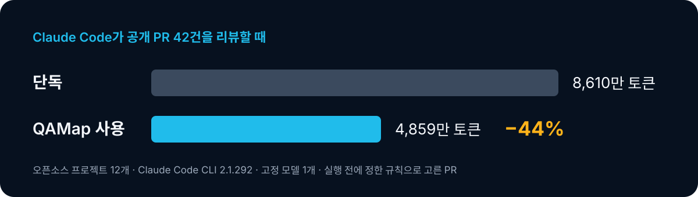
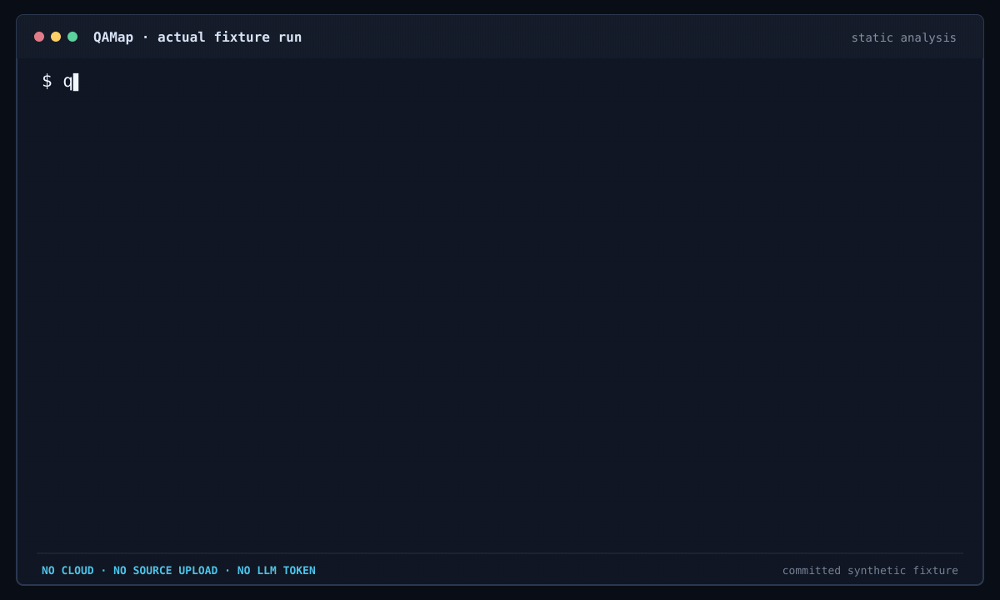

# QAMap

[English](README.md) | **한국어**

[](https://github.com/IvoryCanvas/QAMap/actions/workflows/ci.yml?query=branch%3Amain+event%3Apush)
[](https://www.npmjs.com/package/@ivorycanvas/qamap)
[](LICENSE)

**코딩 에이전트가 로컬 브리프 하나에서 PR 리뷰를 시작해 저장소를 덜 뒤지게 합니다.**

QAMap은 로컬에서 브랜치를 읽고 리뷰에 필요한 근거를 크기가 제한된 브리프
하나로 정리합니다. 브리프에는 줄 번호가 붙은 diff, 바뀐 함수의 이름을 쓰는 테스트와
호출 코드, 삭제된 줄의 이력, 그리고 지워진 `throw`나 읽기만 하고 값을 넣지 않는
필드처럼 놓치기 쉬운 변경이 담깁니다. Claude Code나 Codex는 이 브리프를 바탕으로
리뷰합니다. QAMap 자체는 LLM을 호출하지 않으며 코드를 외부로 보내지 않습니다.



## 측정 결과

실행 전에 정한 규칙으로 오픈소스 프로젝트 12개에서 고른 공개 PR 42건입니다.

| Claude Code CLI 2.1.292, 고정 모델 1개 | 단독 | QAMap 사용 |
| --- | ---: | ---: |
| 토큰, PR 42건 전체 | 8,610만 | 4,859만 (-44%) |
| QAMap 쪽이 토큰을 덜 쓴 PR | - | 42건 중 35건 |
| LLM 블라인드 채점, PR 36건: 더 낫다고 판정된 PR(무승부 4건) / 유효한 지적 | 18건 / 19개 | 14건 / 16개 |
| 정적 리뷰만 지시했는데도 테스트 러너나 패키지 설치를 실행한 경우 | 48회 중 5회 | 48회 중 0회 |
| 프로젝트가 나중에 고친 회귀 6건(각 2회 실행), 찾은 실행 + 일부 찾은 실행 | 3 + 0 | 5 + 5 |

QAMap 사용 열은 0.5.1 이후 아직 배포하지 않은 빌드이며, 다음 릴리스 전까지 `@latest`는
0.5.1을 설치합니다. 이 빌드의 변경은 PR 42건의 리뷰와 브리프를 읽은 뒤 설계했으므로
어느 행도 독립적인 근거가 아닙니다. 표 마지막 행의 변경 신호는 그 회귀 6건을 겨냥했고,
세 번의 측정 중 QAMap 쪽이 더 많이 찾은 것은 이번이 처음입니다. 선호도는 Claude Code
단독 쪽으로 기울었지만 통계적으로 유의하지 않습니다(p = 0.60). Codex는 측정하지
않았습니다. 토큰은 호스트의 사용량 기록이며 대부분 캐시된 입력이고, 정가 기준 추정
비용은 34% 줄었습니다. 단일 실행 간 편차도 커서, 바이트까지 똑같은 브리프를 받고도
90만 토큰과 200만 토큰을 쓴 경우가 있습니다.
[측정 방법, 모든 실행 기록, 한계](test/benchmarks/review-host/external/RESULTS.md)

## 설치하고 실행하기

### 로컬 CLI (권장)

Node.js 20 이상이 설치되어 있다면 CLI를 설치하고, 저장소에서 한 번만 Claude Code와
Codex용 설정을 만드세요. 생성된 파일은 리뷰할 diff에 섞이지 않도록 기본 브랜치에 커밋합니다.

```sh
npm install -g @ivorycanvas/qamap
qamap init --agent
```

리뷰할 브랜치에서 에이전트에게 "**QAMap으로 이 PR을 리뷰해줘**"라고 요청하면 됩니다.
벤치마크는 `qamap init --agent --review-mode report`를 사용했으며, 이 옵션은 이 저장소에서
에이전트가 묻지 않고 QAMap을 실행하도록 기록합니다. 브리프를 직접 보려면 `qamap qa brief`를 실행하세요.

`init --agent`는 `AGENTS.md` 섹션, 스킬 파일, `qamap.config.json`을 추가합니다.
`qa brief`는 저장소를 읽기만 하며 보고서를 `~/QAMap-reports/`에 저장합니다.
다른 패키지 매니저나 커밋하지 않은 변경은 [도입 가이드](docs/adoption.md)를 참고하세요.

### ChatGPT와 Codex 플러그인

[](https://chatgpt.com/plugins/plugins_6a752ca134a481919b90c45c09ab1629)

[플러그인 설치 방법](https://learn.chatgpt.com/docs/plugins#install-and-use-a-plugin)

사용하는 앱에서 로컬 저장소와 터미널에 접근할 수 있어야 합니다.

### Claude Code 플러그인

Claude Code용 플러그인이 디렉터리에 공개되었습니다.
[Claude Code 설치 가이드](docs/ko/claude-code.md)에서 플러그인 설치,
별도로 필요한 CLI와 첫 사용 동의 절차를 확인할 수 있습니다.

설정을 마치면 **"이 PR에 버그가 없는지 확인해줘"**라고 요청할 수 있습니다.
선택한 방식이 없으면 스킬이 QAMap 사용 여부를 묻습니다. 설치만으로 분석이나
테스트 실행에 동의한 것으로 보지는 않습니다.

**토큰 사용:** QAMap의 로컬 분석은 모델을 호출하지 않습니다. 다만 에이전트가
실행을 요청하고 결과를 해석할 때는 모델 토큰을 사용하며, 절감을 보장하지는 않습니다.

## 브리프 읽는 방법

| 브리프 항목 | 리뷰어가 얻는 것 |
| --- | --- |
| **변경** | 줄 번호가 붙은 hunk, 변경 신호, hunk 사이에서 보이지 않는 줄 |
| **사용처** | 바뀐 함수의 이름을 쓰는 테스트, 그 함수를 호출하는 코드와 호출 코드의 테스트 |
| **검증할 항목** | "동작 → 기대 결과"로 바꾸거나 한 줄로 제외할 패턴 점검 |
| **미확인** / **전부 보이지 않은 파일** | 브리프가 확정하지 못한 것과 다음에 읽을 `git diff` |

사람이 직접 검토한다면 `qamap qa`로 QA 계획을 보고, `qamap qa run`으로 선택한 저장소
명령을 실행하고, `qamap e2e draft . --dry-run`으로 선택적 자동화를 미리 볼 수 있습니다.
요청하지 않으면 아무것도 실행하지 않습니다. [브리프 안내](docs/ko/agent-brief.md),
[명령어 안내](docs/commands.md)

## 실제 실행 예시

공개 예제 저장소에서 구독 갱신 흐름을 바꾼 변경을 사람이 보는 QA 계획(`qamap qa`)입니다.



[실제 CLI 출력과 첫 실행 과정을 자세히 보기](docs/ko/quickstart.md)

## 동작 방식

QAMap은 diff, 이력, 테스트를 읽어 바뀐 선언과 그 테스트, 호출 코드를 찾고, 변경 신호와
QA 초점을 더해 브리프 하나에 담습니다. 넓은 추측보다 실제 변경 근거를 먼저 봅니다.
이름만 같은 결과는 이름 일치로 표시하고, 추적하지 못했거나 브리프에 다 담지 못한
내용은 따로 알려줍니다. 근거가 부족하면 계약이나 성공 결과를 임의로 만들지 않고
부족하다고 밝힙니다.
[분석 범위와 한계](docs/ko/repository-discovery.md)

## 목적별 문서

| 목적 | 문서 |
| --- | --- |
| 브랜치 하나를 처음 분석하기 | [한국어 빠른 시작](docs/ko/quickstart.md) |
| 팀에서 반복해서 사용하기 | [도입 가이드](docs/adoption.md) |
| 에이전트와 함께 사용하기 | [한국어 에이전트 연동](docs/ko/agent-integration.md) |
| Claude Code 플러그인 설치하기 | [Claude Code 설치 가이드](docs/ko/claude-code.md) |
| 전체 명령 확인하기 | [명령어 안내](docs/commands.md) |
| 벤치마크 근거 확인하기 | [벤치마크](docs/benchmarking.md) |

## 현재 한계

QAMap은 아직 `1.0` 이전 단계입니다. 브리프와 QA 계획은 리뷰어를 위한 근거일 뿐
제품 명세나 증명이 아니며, 동작이 의도인지 결함인지는 사람이 판단합니다.

## 기여하기

잘못된 판단, 놓친 위험, 사용할 수 없는 초안을 환영합니다.
[CONTRIBUTING.md](CONTRIBUTING.md)에서 시작해 주세요. 비공개 저장소, 고객
정보, 인증 정보는 공개 이슈나 재현 자료에 포함하면 안 됩니다.

[English README](README.md) | [행동 강령](CODE_OF_CONDUCT.md) | [MIT 라이선스](LICENSE)
