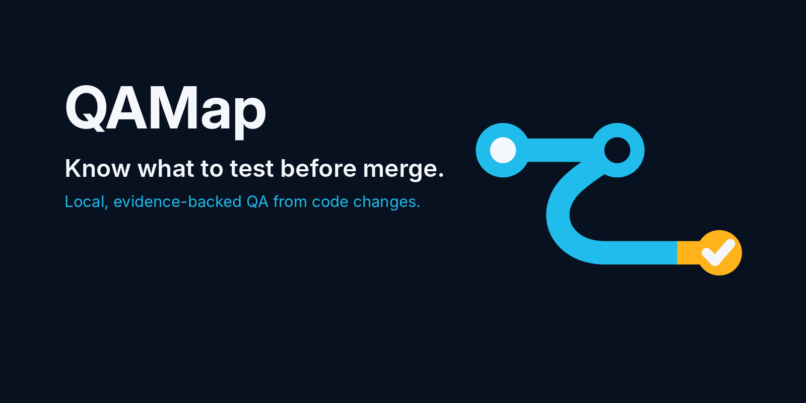
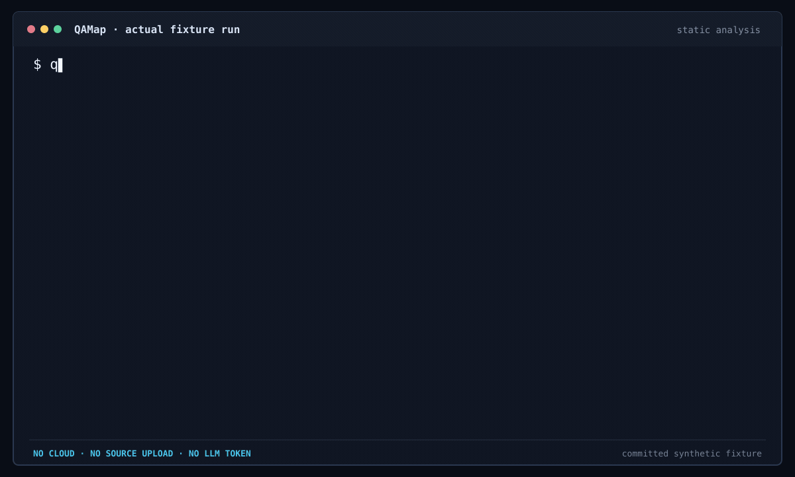

# QAMap

**English** | [한국어](README.ko.md)

[](https://github.com/IvoryCanvas/QAMap/actions/workflows/ci.yml)
[](https://www.npmjs.com/package/@ivorycanvas/qamap)
[](LICENSE)



**Find what a change needs to prove before merge.**

QAMap is a local-first QA CLI. It reads the current branch, repository structure,
existing tests, and diff evidence to answer:

1. What behavior changed?
2. What could fail?
3. What should be verified before merge, and why?
4. What can be checked now or drafted as E2E?

QAMap itself makes no cloud analysis, source upload, or additional LLM call. A
manifest and test runner are optional.

For agent integrations, QAMap keeps reusable repository QA facts separate from
the current pull request delta. Stable identifiers make repeated context visible
without claiming that the calling agent uses no model tokens.

## Install And Run

Choose the local CLI for any repository, or
[install the QAMap plugin](https://chatgpt.com/plugins/plugins_6a752ca134a481919b90c45c09ab1629)
when you want ChatGPT or Codex to invoke the same workflow.

### Local CLI (Recommended)

QAMap requires Node.js 20 or newer. Use an
[actively supported Node.js LTS release](https://nodejs.org/en/about/previous-releases)
when possible.

Run commands from the branch you want to review.

#### Try Without Changing The Repository

This one-off command works regardless of whether the repository uses npm, pnpm,
Yarn, or Bun. It does not add QAMap to the project's dependencies:

```sh
npx --yes @ivorycanvas/qamap@latest qa
```

#### Install For Repeat Use

To pin QAMap in a JavaScript project, use the repository's package manager:

| Package manager | Install | Add the short scripts |
| --- | --- | --- |
| npm | `npm install --save-dev @ivorycanvas/qamap` | `npm exec -- qamap init --scripts` |
| pnpm | `pnpm add --save-dev @ivorycanvas/qamap` | `pnpm exec qamap init --scripts` |
| Yarn 1 or newer | `yarn add --dev @ivorycanvas/qamap` | `yarn qamap init --scripts` |
| Bun | `bun add --dev @ivorycanvas/qamap` | `bun run qamap init --scripts` |

Short scripts, alternative one-off commands, Node.js validation, and advanced
options are collected in [Daily CLI Use](#daily-cli-use).

### ChatGPT And Codex Plugin

Install the plugin when you want an agent to call QAMap as part of PR review or
test planning.

<a href="https://chatgpt.com/plugins/plugins_6a752ca134a481919b90c45c09ab1629">
  
</a>

[Install the QAMap plugin](https://chatgpt.com/plugins/plugins_6a752ca134a481919b90c45c09ab1629)
| [OpenAI's official plugin installation steps](https://learn.chatgpt.com/docs/plugins#install-and-use-a-plugin)

1. Open the QAMap listing.
2. Select **+**.
3. Start a new ChatGPT or Codex conversation with access to the checked-out
   repository and local shell.

The plugin invokes the same local QAMap package. QAMap's static analysis makes
no additional LLM call, but the host agent uses its own model and permissions.

## Read The Result

| Section | Question it answers |
| --- | --- |
| **Change** | What behavior probably changed? |
| **Verify before merge** | Which normal, failure, boundary, or state-transition checks matter? |
| **Evidence** | Which commit, file, line, or symbol supports each judgment? |
| **Next** | Is there an existing command to run or an optional draft to preview? |

QAMap keeps static reasoning and executed QA separate. A proposed scenario or E2E
draft is never reported as a passing test.

When one change modifies several independent test or benchmark contracts,
QAMap keeps every applicable command visible. `qamap qa run` remains bounded to
one selected command; the others appear as **Additional required validation**
and remain `not run` until they are executed explicitly. **Supplemental
validation** means a repository command exists but was not selected as proof for
this QA route.

For supported runtime contracts, QAMap can trace a changed entry point through
local imports to a required provider. A test that mocks away that prerequisite
is disclosed as incomplete evidence instead of being promoted as proof.

Delivery checks run before optional E2E work when the diff references a missing
asset or a validation workflow can rewrite shared history. Supported activation
changes also retain the guard, configuration source, runtime side effect, and
restart or reload boundary that must be verified.

Cleanup-only commits remain visible as provenance but do not become standalone
QA requirements. Unrelated issue tags and lifecycle stages stay separate. When
the changed source does not prove an externally observable result, QAMap reports
that proof gap instead of turning a commit title or function name into an
assertion.

## See A Real Run

This recording uses a committed public fixture. QAMap finds a duplicate-request
guard, routes the relevant scenarios, cites changed lines, and leaves execution
marked `not run`.



<details>
<summary>Open the shortened terminal output</summary>

```txt
QAMap QA
Local static analysis. No cloud or LLM token. Product QA was not run.

Change
  Prevent duplicate subscription renewal requests (medium confidence; review required)
  Flow:
    action: Prevent duplicate subscription renewal requests.
    -> observable-outcome: Subscription status becomes active.
  Affected behavior: Prevent duplicate subscription renewal requests

Verify before merge
  REQUIRED  Prevent duplicate subscription renewal requests
    Proof: Verify visible text "Subscription active" appears.
    Evidence: src/pages/renewal.tsx:11 (RenewalPage)
  RECOMMENDED  Failure, timeout, and retry handling
    Proof: Verify each response produces the intended visible or persisted state.
    Evidence: src/pages/renewal.tsx:11 (RenewalPage)
  RECOMMENDED  Duplicate renewal request
    Proof: Verify duplicate renewal request is prevented or handled explicitly.
    Evidence: src/pages/renewal.tsx:11 (RenewalPage)

Evidence
  3/3 scenarios connect to 5 unique diff source(s).
  Routing: 1 required, 2 recommended, 0 review-only.
  Optional E2E mapping: 1 mapped, 1 partial, 1 unmapped; not executed.
  Supplemental validation: npm run test:e2e (available, not selected for this QA route)

Next
  Review the selected scenarios before choosing an execution step.
  Preview an optional automation or checklist draft: qamap e2e draft . --dry-run
  Open the full reasoning trace: qamap qa --format markdown
```

</details>

The generated browser checks are exercised separately by the
[execution benchmark](docs/benchmarking.md#run-the-execution-contract).

The [agent token benchmark](docs/benchmarking.md#run-the-agent-token-benchmark) reports provider-reported tokens, tool calls, and deterministic task success for the same QA tasks with and without QAMap; it infers no pricing or fixed saving.

## Daily CLI Use

### Add Short Scripts

`init --scripts` adds `qa`, `qa:local`, `qa:run`, and `qa:e2e`. Run the same
script with the syntax your project already uses:

```sh
npm run qa       # npm
pnpm qa          # pnpm
yarn qa          # Yarn
bun run qa       # Bun
```

Replace `qa` with `qa:local` to include uncommitted changes, `qa:run` to run the
selected existing validation, or `qa:e2e` to preview the optional E2E draft.
Non-JavaScript repositories can keep using the universal `npx` command.

<details>
<summary>Package-manager-specific one-off commands</summary>

These commands also work without adding QAMap as a project dependency:

```sh
pnpm dlx @ivorycanvas/qamap@latest qa
yarn dlx @ivorycanvas/qamap@latest qa  # Yarn 2+
bunx @ivorycanvas/qamap@latest qa
```

Yarn Classic users can use the universal `npx` command or install QAMap in the
project. Corepack-managed package managers may add or update the repository's
`packageManager` metadata; use the `npx` first run when a no-write check matters.

</details>

<details>
<summary>Validated Node.js lines</summary>

The published `0.4.13` package completed an install and real `qa` smoke on these
lines on 2026-08-11. The install command is the same for every line.

| Node.js | Smoke | Guidance |
| --- | --- | --- |
| 20 | Passed | Package-compatible, but upstream EOL; upgrade for security fixes |
| 22 | Passed | Supported LTS at the time of validation |
| 24 | Passed | Supported LTS at the time of validation |
| 26 | Passed | Current release at the time of validation; prefer LTS for production |

See the [package-manager compatibility receipt](docs/release-validation.md#package-manager-compatibility---2026-08-11)
for exact versions and package-manager coverage.

</details>

### Useful CLI Options

QAMap infers the base branch in standard repositories. Override it only when
needed:

```sh
npx --yes @ivorycanvas/qamap@latest qa . --base origin/main --head HEAD
```

The default output is concise. Open the complete reasoning trace with:

```sh
npx --yes @ivorycanvas/qamap@latest qa --format markdown
```

## Analysis, Execution, And E2E

| Command | What it does | Writes or runs project code? |
| --- | --- | --- |
| `qamap qa` | Maps the diff to behavior, risk, evidence, and QA scenarios. | No |
| `qamap qa run` | Runs one selected repository validation. Other required commands stay listed and `not run`. | Yes, explicitly |
| `qamap e2e draft . --dry-run` | Previews optional Playwright, Maestro, CLI, API, or manual automation. | No |
| `qamap e2e run <scenario-id>` | Executes one compiled scenario through the executor and fixtures declared in `qamap.config.json`, then stores and compares the receipt. | Yes, the declared executor and seed hooks |

QAMap does not hide an important QA scenario because a repository lacks a
selector, fixture, Playwright, Maestro, or test runner. Those are automation
details. Missing evidence remains visible instead of becoming a fabricated pass.

## How It Works

```txt
commit + diff
    -> changed behavior and flow
    -> risk and QA scenario routing
    -> file and line reasoning trace
    -> existing validation or optional E2E draft
```

QAMap ranks direct changed behavior ahead of broad repository guesses. Shared
components can reach importing surfaces through reverse-import context, while
unrelated consumers remain out of scope.

## Agents And Team Context

Agents can consume the same decision in a compact, versioned payload:

```sh
npx --yes @ivorycanvas/qamap@latest qa --format agent
```

The payload separates stable repository QA context from the current PR delta
with content-derived IDs. Agents can reuse unchanged manifest, validation, and
behavior blocks and open the private local recovery report only when detailed
evidence is needed.

Install the portable project skill with `skills add`, use `qamap init --agent`,
or install the published
[OpenAI Plugin Directory](https://chatgpt.com/plugins/plugins_6a752ca134a481919b90c45c09ab1629)
version. Every path calls the same local CLI. See
[Agent integration](docs/agent-skill.md).

The first run needs no configuration. If QAMap repeatedly misunderstands a
durable team flow, create and review repo-local QA context:

```sh
npx --yes @ivorycanvas/qamap@latest manifest init
```

See [Verification manifest](docs/manifest.md) before committing
`.qamap/manifest.yaml`.

## Documentation

| Goal | Start here |
| --- | --- |
| Review one branch | [First-run walkthrough](docs/quickstart-demo.md) |
| Use QAMap every day | [Adoption guide](docs/adoption.md) |
| Use QAMap from an agent | [Agent integration](docs/agent-skill.md) |
| Correct repeated misunderstandings | [Verification manifest](docs/manifest.md) |
| Understand every command | [Command reference](docs/commands.md) |
| Contribute a fix or failure case | [Contributing](CONTRIBUTING.md) |
| Browse all documentation | [English documentation](docs/en/README.md) |

Most users only need the first two rows.

## Limits

QAMap is early and pre-`1.0`. Static analysis cannot know every product decision.
Inferred scenarios require review, and one green repository command does not
prove that the whole product passed QA.

The public release gate includes cross-framework, API, CLI, monorepo, testless,
false-positive, scenario-to-diff trace, generated-browser-test, package, coverage,
and no-private-fixture contracts. See [Benchmarking](docs/benchmarking.md) for
the exact evidence.

## Other Languages

- [한국어 README](README.ko.md)
- [한국어 문서](docs/ko/README.md)

## Contributing

Real false positives, missed risks, unusable drafts, and minimized failing
repositories are especially valuable. Start with
[CONTRIBUTING.md](CONTRIBUTING.md); public reports must not contain private
repository or customer information.

QAMap does not replace human review, executable tests, or security tooling. It
reduces the repeated work between receiving a change and deciding what that
change must prove.
