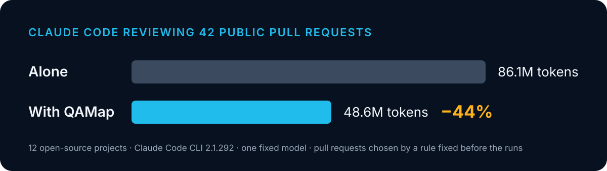

# QAMap

**English** | [한국어](README.ko.md)

[](https://github.com/IvoryCanvas/QAMap/actions/workflows/ci.yml?query=branch%3Amain+event%3Apush)
[](https://www.npmjs.com/package/@ivorycanvas/qamap)
[](LICENSE)

**Give your coding agent one local brief to start a pull request review from, so it explores the repository less.**

QAMap reads the branch on your machine and prints one size-limited brief: the numbered
diff, the tests and callers that name each changed function, the history behind removed
lines, and easy-to-miss changes such as a removed `throw` or a field that is read
but never assigned. Claude Code or Codex reviews from it. QAMap itself makes no
LLM call and uploads nothing.



## Results

42 public pull requests from 12 open-source projects, chosen by a rule fixed before the runs:

| Claude Code CLI 2.1.292, one fixed model | Alone | With QAMap |
| --- | ---: | ---: |
| Tokens, all 42 pull requests | 86.1M | 48.6M (-44%) |
| Pull requests where QAMap used fewer tokens | - | 35 of 42 |
| Blind LLM grade, 36 pull requests: preferred (4 ties) / valid findings | 18 / 19 | 14 / 16 |
| Runs that started a test runner or package install in a static review | 5 of 48 | 0 of 48 |
| Runs that found a regression the project fixed later (6 regressions, 2 runs each), found + partly found | 3 + 0 | 5 + 5 |

With QAMap is the unreleased build after 0.5.1; until the next release, `@latest` installs
0.5.1. Its changes were designed after reading the reviews and briefs of these 42 pull
requests, so no row is independent evidence. The last row's change signals target those six
regressions, and this is the first of three measurements in which QAMap found more of them.
The preference leans to Claude Code alone and is not statistically significant (p = 0.60).
Codex was not measured. Tokens are the host's usage receipt, mostly cached input; the
list-price estimate fell 34%. Single runs vary: one pair of byte-identical briefs used 0.9M
and 2.0M tokens. [Protocol, every run and limits](test/benchmarks/review-host/external/RESULTS.md).

## Install And Run

### Local CLI (Recommended)

With Node.js 20 or newer, install the CLI and set up the repository once for Claude Code
and Codex. Commit the files it writes on the default branch, outside the reviewed diff:

```sh
npm install -g @ivorycanvas/qamap
qamap init --agent
```

On the branch to review, ask your agent: **"Use QAMap to review this PR."** The benchmark
used `qamap init --agent --review-mode report`, which lets agents run QAMap in this
repository without asking first. To read the brief yourself, run `qamap qa brief`.

`init --agent` writes an `AGENTS.md` section, skill files and `qamap.config.json`.
`qa brief` only reads the repository and saves its report under `~/QAMap-reports/`.
The [adoption guide](docs/adoption.md) covers other package managers and uncommitted changes.

### ChatGPT And Codex Plugin

<a href="https://chatgpt.com/plugins/plugins_6a752ca134a481919b90c45c09ab1629">
  
</a>

[Plugin installation help](https://learn.chatgpt.com/docs/plugins#install-and-use-a-plugin)

The host needs access to the local repository and terminal.

### Claude Code Plugin

QAMap is published in the Claude directory for Claude Code.
The [Claude Code setup guide](docs/claude-code.md) covers plugin installation,
the separately required CLI, and first-use consent.

Once set up, ask **"Check this PR for bugs."** The skill offers QAMap when no
choice is recorded; installing it is not consent to analysis or test execution.

**Token boundary:** QAMap's local analysis makes no model calls. An agent still
uses model tokens to invoke QAMap and interpret the report; savings are not guaranteed.

## Read The Brief

| Brief section | What the reviewer gets |
| --- | --- |
| **Changes** | Numbered hunks, change signals, and lines a hunk leaves out. |
| **References** | Tests that name each changed function, its callers and their tests. |
| **What to verify** | Pattern checks to turn into action and expected result, or dismiss. |
| **Unknowns, Not fully shown** | What the brief could not settle, and the `git diff` to read next. |

For human reviewers, `qamap qa` prints a QA plan, `qamap qa run` executes a
selected repository command, and `qamap e2e draft . --dry-run` previews optional
automation. Nothing runs unless you ask. See the [brief guide](docs/agent-brief.md) and
the [command reference](docs/commands.md).

## See A Real Run

The human QA plan, `qamap qa`, for a public fixture that changes a subscription renewal flow:


[Open the exact CLI output and first-run walkthrough](docs/quickstart-demo.md).

## How It Works

QAMap reads the diff, history and tests, finds the changed declarations with their tests
and callers, adds change signals and QA focus, and fits them into one brief. It follows direct change evidence before broad guesses, labels name matches as
name matches, and lists what it could not trace or fit. When evidence is
insufficient, it says so instead of inventing a contract or a passing result.
[Coverage and limits](docs/repository-discovery.md).

## Documentation

| Goal | Guide |
| --- | --- |
| Review one branch | [First-run walkthrough](docs/quickstart-demo.md) |
| Adopt QAMap in a team | [Adoption guide](docs/adoption.md) |
| Use QAMap from an agent | [Agent integration](docs/agent-skill.md) |
| Set up the Claude Code plugin | [Claude Code setup](docs/claude-code.md) |
| Review every command | [Command reference](docs/commands.md) |
| Inspect benchmark evidence | [Benchmarking](docs/benchmarking.md) |

## Limits

QAMap is pre-`1.0`. A brief or QA plan is evidence for a reviewer, not a product
specification or proof: a person decides whether a behavior is intended or broken.

## Contributing

False positives, missed risks, and unusable drafts are especially useful. Start
with [CONTRIBUTING.md](CONTRIBUTING.md), and never publish private repository,
customer, or credential data.

[한국어 README](README.ko.md) | [Code of Conduct](CODE_OF_CONDUCT.md) | [MIT License](LICENSE)
